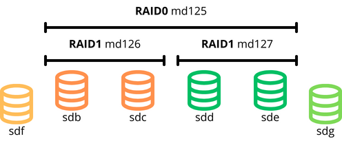
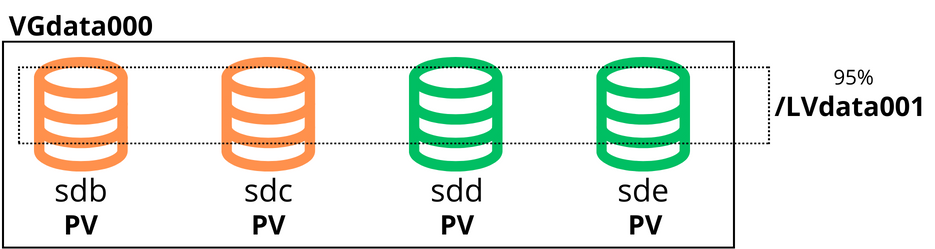
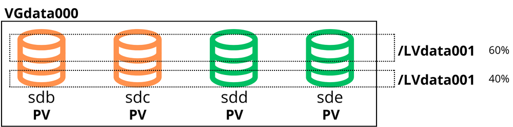

# RAIDS y LVM

## Introducción

La redundancia aporta un nivel más de seguridad en caso de pérdida de datos de una base de datos. En esta práctica veremos como solventar la pérdida de datos en caso de accidente. Para ello utilizaremos un RAID10 que estará gestionado por volúmenes lógicos.

## Desarrollo

### Esquema RAIDS

El primer paso es crear el RAID10, necesitaremos 6 discos (5GB). Con la controladora mdadm gestionaremos los RAID. Este es el esquema que queremos conseguir:



```bash
// Miramos si está instalado, de lo contrario lo instalamos.
$sudo apt install mdadm
 ```

 Podemos ver información de los discos mediante los comandos **lsblk**, **df -h \<disco\>** y **fdisk -l**.

 **RAID 1**
 
 Lo crearemos con los nombres md0, md1 y md2, luego al crear los raids lo cambiará, el resultado será como el esquema de la imagen previa.

```bash
// Primer RAID1 (md0):

$mdadm --create /dev/md0 --level=1 --raid-devices=2 /dev/sdb /dev/sdc
 ```

 ```bash
// Segundo RAID1 (md1):

$mdadm --create /dev/md1 --level=1 --raid-devices=2 /dev/sdd /dev/sde
 ```

 **RAID 0**

```bash
// RAID0 (md2):

$mdadm --create /dev/md2 --level=0 --raid-devices=2 /dev/md1 /dev/md2
 ```


 **UNIDADES DE REPUESTO**

```bash
// Añadimos el disco sdf al RAID1 md0:

$mdadm --add /dev/md0 /dev/sdf
 ```

 ```bash
// Añadimos el disco sdg al RAID1 md1:

$mdadm --add /dev/md1 /dev/sdg
 ```

 Para ver los detalles de los discos y su están sincronizados utilizamos el siguiente comando:

 ```bash
$mdadm --detail --scan
$mdadm --detail /dev/md0
 ```

 **DAMOS FORMATO AL RAID10**
 ```bash
$mkfs.ext4 /dev/md0
 ```

 ## LVM - Logic Volume Manager
  Permite crear volúmenes lógicos a partir de múltiples discos duros físicos o particiones, brindando la posibilidad de redimensionar, mover y administrar estos volúmenes de manera dinámica, sin necesidad de apagar el sistema. LVM proporciona una capa de abstracción entre los dispositivos de almacenamiento físico y el sistema de archivos, permitiendo una gestión más versátil y optimizada del espacio de almacenamiento. Conceptos clave:

1. **Volúmenes Físicos (PVs)**: Discos o particiones de almacenamiento.

2. **Grupos de Volúmenes (VGs)**: Agrupación de volúmenes físicos.

3. **Volúmenes Lógicos (LVs)**: Unidades de almacenamiento flexibles para usuarios y aplicaciones.


Para la práctica crearemos un volúmen lógico que ocupará el 95% del almacenamiento.



Comprobamos si tenemos LVM instalado, de lo contrario hacemos:
```bash
$sudo apt install lvm2
```

Primero creamos el **volumen físico**:
```bash
$sudo pvcreate /dev/md125
WARNING: ext4 signature detected on /dev/md125 at offset 1080. Wipe it? [y/n]: y
  Wiping ext4 signature on /dev/md125.
  Physical volume "/dev/md125" successfully created.
```

Para ver el volumen:
```bash
$sudo pvscan
  PV /dev/md125                      lvm2 [9,98 GiB]
  Total: 1 [9,98 GiB] / in use: 0 [0   ] / in no VG: 1 [9,98 GiB]
```
A continuación creamos el **grupo de volúmenes**, y lo asociamos con el volúmen físico.
```bash
$sudo vgcreate VGdata000 /dev/md125
  Volume group "VGdata000" successfully created
```

Para ver:
```bash
$sudo vgscan
  Found volume group "VGdata000" using metadata type lvm2
```
Por último creamos el **volúmen lógico** LVdata001:
```bash
$sudo lvcreate -n LVdata001 -l 95%VG VGdata000
```
Para ver:
```bash
$lvscan 
  ACTIVE            '/dev/VGdata000/LVdata001' [<9,48 GiB] inherit
```
Por motivos academicos necesito redimensionar el volúmen lógico y añadiré otro. Dejándolos de la siguiente manera:



```bash
# Lo redimensionamos:
$sudo lvresize -l 60%VG /dev/VGdata000/LVdata001
Size of logical volume VGdata000/LVdata001 changed from 1,00 GiB (256 extents) to <5,99 GiB (1533 extents).
Logical volume VGdata000/LVdata001 successfully resized.

# Comprobamos:
$lvscan 
  ACTIVE            '/dev/VGdata000/LVdata001' [<5,99 GiB] inherit

# Para crear el segundo volúmen lógico:
$sudo lvcreate -n LVdata002 -l 40%VG VGdata000
  Logical volume "LVdata002" created.

# Comprobamos que los dos estén correctamente:
$lvscan 
  ACTIVE            '/dev/VGdata000/LVdata001' [<5,99 GiB] inherit
  ACTIVE            '/dev/VGdata000/LVdata002' [<3,99 GiB] inherit

```

Ahora montaremos el primer volúmen y crearemos contenido:

```bash
# Para darle formato:
$sudo mkfs.ext4 /dev/VGdata000/LVdata001

# Carpeta donde lo montaremos:
$sudo mkdir /mnt/LVdata001
$cd /mnt/LVdata001

# Montamos:
$sudo mount /dev/VGdata000/LVdata001 /mnt/LVdata001

# Para crear contenido:
$dd if=/dev/zero of=/mnt/LVdata001/archivo1.img bs=1M count=1000
```
Ahora queremos comprobar que si un disco falla, uno de los de repuesto entra en acción, el contenido de estos archivos no se verá afectado, para ello haremos lo siguiente:

```bash
# Creamos la función de resumen de la carpeta antes creada, donde hemos montado el volúmen lógico, para después poder comprobar su integridad:

$md5sum /mnt/LVdata001/archivo1.img > checksumLV1.txt
$ls
archivo1.img  checksumLV1.txt  lost+found

```


