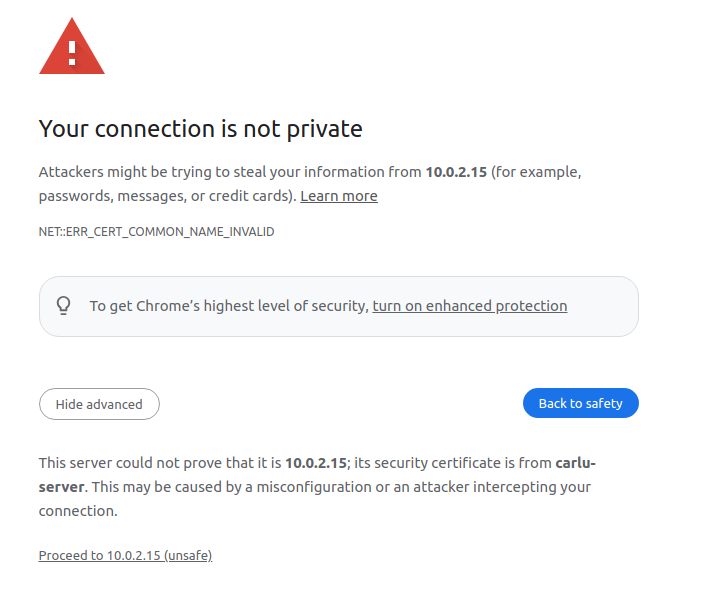
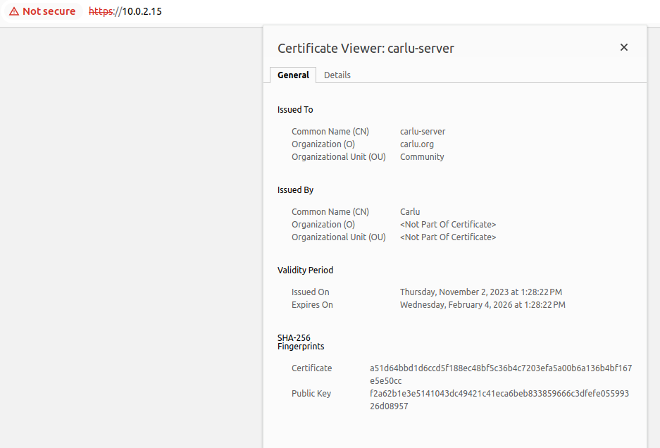
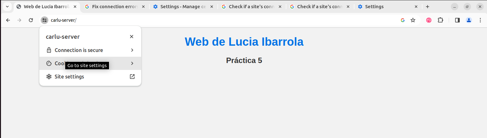

# CERTIFICADO TLS

## Introducción

Internet, a pesar de sus ventajas, no es un entorno seguro. Las amenazas en línea, como el phishing, el malware y la interceptación de datos, son preocupaciones constantes. Los certificados TLS son fundamentales para mejorar la seguridad de las comunicaciones en Internet y proteger la privacidad de los usuarios. En esta práctica, exploraremos su importancia en un entorno cibernético inseguro, configurando un certificado usando Apache.

## Desarrollo

### Instalar y configurar una entidad de certificación (CA)

#### Paso 1: Instalar Easy-RSA

El primer paso es actualizar el sistema:

```bash
sudo apt update
```

Ahora instalamos easy-rsa:
```bash
sudo apt install easy-rsa
```
#### Paso 2: Preparar un directorio para la infraestructura de clave pública

Ahora que instaló easy-rsa, es el momento de crear una infraestructura de clave pública (PKI) de esqueleto en el servidor de CA. Verifique que siga conectado con su non-root user y cree un directorio easy-rsa. Asegúrese de no utilizar sudo para ejecutar ninguno de los siguientes comandos, dado que su usuario normal debe administrar la CA e interactuar con ella sin privilegios elevados.

```bash
mkdir ~/easy-rsa
```

Con esto se creará un directorio nuevo llamado easy-rsa en su carpeta de inicio. Usaremos este directorio para crear enlaces simbólicos que apunten a los archivos del paquete easy-rsa que instalamos en el paso anterior. Estos archivos se encuentran en la carpeta /usr/share/easy-rsa en el servidor de CA.

Cree los enlaces simbólicos con el comando ln:

```bash
ln -s /usr/share/easy-rsa/* ~/easy-rsa/
```

Para restringir el acceso a su nuevo directorio de la PKI, asegúrese de que solo el propietario pueda acceder a él usando el comando chmod:

```bash
chmod 700 /home/sammy/easy-rsa
```

Por último, inicie la PKI dentro del directorio easy-rsa:

```bash
cd ~/easy-rsa
./easyrsa init-pki

Output:

init-pki complete; you may now create a CA or requests.
Your newly created PKI dir is: /home/lucia/easy-rsa/pki
```
Después de completar esta sección, tendrá un directorio con todos los archivos necesarios para crear una entidad de certificación. En la siguiente sección, creará la clave privada y el certificado público para su CA.

### Paso 3: Crear una entidad de certificación

Para poder crear la clave privada y el certificado de su CA, debe crear y completar un archivo llamado vars con algunos valores predeterminados. Primero, usará cd para ingresar al directorio easy-rsa y, luego, creará y editará el archivo vars con nano o el editor de texto que prefiera:

```bash
cd ~/easy-rsa
nano vars
```
Una vez que se abra el archivo, pegue las siguientes líneas y sustituya cada valor resaltado por la información de su propia organización. Lo importante aquí es asegurarse de no dejar ninguno de los valores en blanco:

```bash
set_var EASYRSA_REQ_COUNTRY    "ES"
set_var EASYRSA_REQ_PROVINCE   "Valencia"
set_var EASYRSA_REQ_CITY       "Valencia"
set_var EASYRSA_REQ_ORG        "Carlu.org"
set_var EASYRSA_REQ_EMAIL      "lucibaele@alu.edu.gva.es"
set_var EASYRSA_REQ_OU         "Community"
set_var EASYRSA_ALGO           "ec"
set_var EASYRSA_DIGEST         "sha512"
```

Cuando termine, guarde y cierre el archivo. Con esto, estará listo para crear su CA.

Para crear el certificado root público y el par de claves privadas para su entidad de certificación, vuelva a ejecutar el comando ./easy-rsa, aunque esta vez con la opción build-ca:

```bash
./easyrsa build-ca
Using SSL: openssl OpenSSL 3.0.2 15 Mar 2022 (Library: OpenSSL 3.0.2 15 Mar 2022)

Enter New CA Key Passphrase: 
Re-Enter New CA Key Passphrase: 
You are about to be asked to enter information that will be incorporated
into your certificate request.
What you are about to enter is what is called a Distinguished Name or a DN.
There are quite a few fields but you can leave some blank
For some fields there will be a default value,
If you enter '.', the field will be left blank.
-----
Common Name (eg: your user, host, or server name) [Easy-RSA CA]:Carlu

CA creation complete and you may now import and sign cert requests.
Your new CA certificate file for publishing is at:
/home/lucia/easy-rsa/pki/ca.crt
```

Contraseña: student

Ahora, tiene dos archivos importantes, ~/easy-rsa/pki/ca.crt y ~/easy-rsa/pki/private/ca.key, que conforman los componentes públicos y privados de una entidad de certificación.

Con esto, estableció su CA y esta se encuentra lista para emplearse en la firma de solicitudes de certificados y revocar certificados.

#### Paso 4: Distribuir el certificado público de su entidad de certificación

Ahora, su CA está configurada y lista para funcionar como root de confianza para cualquier sistema que desee que la use. Puede agregar el certificado de la CA a sus servidor Apache. Cualquier usuario o servidor que necesite verificar la identidad de otro usuario o servidor de su red debe contar con una copia del archivo ca.crt importada en el almacén de certificados de su sistema operativo.

Para importar el certificado público de la CA a un segundo sistema de Linux, como otro servidor o una computadora local, primero debe obtener una copia del archivo ca.crt de su servidor de CA. Puede usar el comando cat para ver el resultado en una terminal y, luego, copiarlo y pegarlo en un archivo en la segunda computadora en la que se importe el certificado. También puede usar herramientas como scp y rsync para transferir el archivo entre sistemas. Sin embargo, usaremos el método de copiar y pegar con nano en este paso, ya que funciona en todos los sistemas.

Como non-root user en el servidor de CA, ejecute el siguiente comando:

```bash
cat ~/easy-rsa/pki/ca.crt

Output:
-----BEGIN CERTIFICATE-----
MIIDOTCCAiGgAwIBAgIURdudzFvykwNDuoZCJ1givPFVxLgwDQYJKoZIhvcNAQEL
BQAwEDEOMAwGA1UEAwwFQ2FybHUwHhcNMjMxMTAyMTIwMjEzWhcNMzMxMDMwMTIw
MjEzWjAQMQ4wDAYDVQQDDAVDYXJsdTCCASIwDQYJKoZIhvcNAQEBBQADggEPADCC
AQoCggEBAJ2SKH/5pjQbF8CJbbc8ezmeoeP9oaAOfOJvLoYPkxQPoJACF1D5j3Yh
R/lv99ppzikn8SaXikQ01+4LYNqy0spEpRJEQdsjBaltCLvkofngbGdhiSTqUTTr
x0F8LDf/KnUqAxqRGeOLrM/y6ZPW9mZJQzacuwaRFI4nben1I39xmckQDiH/2r32
lAK6GfsTQxKJ5EUDoiW9QrWkFQHiyPMpuPJ9XWPIVrjyS5WYfKYQsati0Sir0HF4
ucxB+8I2UxyJWe8W5cnAvJ8p4lhDLoIB5Xu/C/1j3FUEd75YOpVsVwAoRu68uzUD
tuXprLSyoP7Lf9VJVvKquBnAH+/qxQkCAwEAAaOBijCBhzAdBgNVHQ4EFgQUPtzy
RdsaKXJAaZ3Hb5yh497imOEwSwYDVR0jBEQwQoAUPtzyRdsaKXJAaZ3Hb5yh497i
mOGhFKQSMBAxDjAMBgNVBAMMBUNhcmx1ghRF253MW/KTA0O6hkInWCK88VXEuDAM
BgNVHRMEBTADAQH/MAsGA1UdDwQEAwIBBjANBgkqhkiG9w0BAQsFAAOCAQEAFs0G
ZTYnQV6eHz4Ieo+K4LUWY0UQFOk1UGoUipaZe7j4GtT+CnGgCk+BLgitzwKvSGa+
n2jW7jjK5HghCDL2QF+vTgUR2zAMdnXqXUamwO6OUCk6l1+mmTWy1XPJ1JnygXYD
sjw4euI2RcWPeYf3qlOa+T3SFVNFVqzTXXZIBhElRohnkt8Ac7gE435C/qH5H0Vm
y4zrbZVkLhukUVIEKRhTg5rnrVy+MgpVMhg2jF5PyS5emAFd/zEr/jafnuF/7rh8
AVaiTOp4JWj1P4yf/iONa0Boaz786puwGvrVUuObDgL7JcBiEXsn7XXrmqmI1bVo
1uHS2QpJDMi6CGD9mw==
-----END CERTIFICATE-----
```

Copie todo, incluso las líneas -----BEGIN CERTIFICATE----- y -----END CERTIFICATE----- y los guiones.

En su segundo sistema de Linux, use nano o el editor de texto que prefiera para abrir un archivo llamado /tmp/ca.crt:

```bash
nano /tmp/ca.crt
```

Y copiamos ahí toda la salida anterior.

Ahora que tiene una copia del archivo ca.crt en su segundo sistema de Linux, es momento de importar el certificado al almacén de certificados de su sistema operativo.

En los sistemas basados en Ubuntu y Debian, ejecute los siguientes comandos como non-root user para importar el certificado:

```bash
sudo cp /tmp/ca.crt /usr/local/share/ca-certificates/
sudo update-ca-certificates
```

### Crear y firmar una solicitud de certificado de prueba CSR

Instalar OpenSSL.

```bash
sudo apt install openssl
```
El primer paso para crear una CSR es generar una clave privada. Para crear una clave privada usando openssl, cree un directorio practice-csr y luego genere una clave dentro de este. En vez de crear un certificado para identificar usuarios u otras CA, crearemos esta solicitud para un servidor ficticio llamado carlu-server.

```bash
mkdir ~/practice-csr
cd ~/practice-csr
openssl genrsa -out carlu-server.key
```

Ahora que tiene una clave privada, puede crear una CSR correspondiente y volver a usar la utilidad openssl. Se le solicitará completar varios campos, como Country, State y City. Puede ingresar . si desea dejar un campo en blanco, pero tenga en cuenta que, si se tratara de una CSR real, sería mejor usar los valores correctos de su ubicación y su organización:

```bash
openssl req -new -key carlu-server.key -out carlu-server.req
You are about to be asked to enter information that will be incorporated
into your certificate request.
What you are about to enter is what is called a Distinguished Name or a DN.
There are quite a few fields but you can leave some blank
For some fields there will be a default value,
If you enter '.', the field will be left blank.
-----
Country Name (2 letter code) [AU]:ES
State or Province Name (full name) [Some-State]:Valencia
Locality Name (eg, city) []:Valencia
Organization Name (eg, company) [Internet Widgits Pty Ltd]:carlu.org
Organizational Unit Name (eg, section) []:Community
Common Name (e.g. server FQDN or YOUR name) []:carlu-server
Email Address []:lucibaele@alu.edu.gva.es

Please enter the following 'extra' attributes
to be sent with your certificate request
A challenge password []:student
An optional company name []:student
```

Para comprobar:

```bash
openssl req -in carlu-server.req -noout -subject
subject=C = ES, ST = Valencia, L = Valencia, O = carlu.org, OU = Community, CN = carlu-server, emailAddress = lucibaele@alu.edu.gva.es
```

Una vez que esté conforme con el asunto de la solicitud de certificado de prueba, copie el archivo carlu-server.req a su servidor de CA utilizando scp:

```bash
scp carlu-server.req lucia@Ubuntu-SEGURIDAD:/tmp/carlu-server.req

#Si se ha realizado ambos en una misma máquina:
cp carlu-server.req /tmp/carlu-server.req
```

En el siguiente paso, procederemos a firmar la solicitud de firma de certificado usando la clave privada del servidor de CA.

### Firmar una CSR

El primer paso para firmar la CSR ficticia es importar la solicitud de certificado usando la secuencia de comandos easy-rsa:

```bash
./easyrsa import-req /tmp/carlu-server.req carlu-server
Using SSL: openssl OpenSSL 3.0.2 15 Mar 2022 (Library: OpenSSL 3.0.2 15 Mar 2022)

The request has been successfully imported with a short name of: carlu-server
You may now use this name to perform signing operations on this request.
```

Ahora, puede firmar la solicitud ejecutando la secuencia de comandos easyrsa con la opción sign-req, seguida del tipo de solicitud y el nombre común incluido en la CSR. El tipo de solicitud puede ser client, server o ca. Debido a que estamos practicando con un certificado para un servidor ficticio, asegúrese de utilizar el tipo de solicitud server:

```bash
./easyrsa sign-req server carlu-server
Using SSL: openssl OpenSSL 3.0.2 15 Mar 2022 (Library: OpenSSL 3.0.2 15 Mar 2022)


You are about to sign the following certificate.
Please check over the details shown below for accuracy. Note that this request
has not been cryptographically verified. Please be sure it came from a trusted
source or that you have verified the request checksum with the sender.

Request subject, to be signed as a server certificate for 825 days:

subject=
    countryName               = ES
    stateOrProvinceName       = Valencia
    localityName              = Valencia
    organizationName          = carlu.org
    organizationalUnitName    = Community
    commonName                = carlu-server
    emailAddress              = lucibaele@alu.edu.gva.es


Type the word 'yes' to continue, or any other input to abort.
  Confirm request details: yes
Using configuration from /home/lucia/easy-rsa/pki/easy-rsa-9055.696Rll/tmp.kvJRdT
Enter pass phrase for /home/lucia/easy-rsa/pki/private/ca.key:
4057215AAC7F0000:error:0700006C:configuration file routines:NCONF_get_string:no value:../crypto/conf/conf_lib.c:315:group=<NULL> name=unique_subject
Check that the request matches the signature
Signature ok
The Subject's Distinguished Name is as follows
countryName           :PRINTABLE:'ES'
stateOrProvinceName   :ASN.1 12:'Valencia'
localityName          :ASN.1 12:'Valencia'
organizationName      :ASN.1 12:'carlu.org'
organizationalUnitName:ASN.1 12:'Community'
commonName            :ASN.1 12:'carlu-server'
emailAddress          :IA5STRING:'lucibaele@alu.edu.gva.es'
Certificate is to be certified until Feb  4 12:28:22 2026 GMT (825 days)

Write out database with 1 new entries
Data Base Updated

Certificate created at: /home/lucia/easy-rsa/pki/issued/carlu-server.crt
```

Ya está firmado y en marcha.

### Configurar sitio apache

Accedemos al fichero default-ssl y añadimos el certificado que acabamos de generar y firmar.

Copiamos el certificado firmado a la carpeta /etc/ssl/certs:

```bash
lucia@lucia-VirtualBox:~/easy-rsa/pki/issued$ sudo cp carlu-server.crt /etc/ssl/certs
```

Y también copiamos la llave de la petición:
```bash
lucia@lucia-VirtualBox:~/practice-csr$ sudo cp carlu-server.key /etc/ssl/private/
```

Por último en el ficjero /etc/apache2/sites-available/default-ssl.conf editamos estas dos líneas:

- SSLCertificateFile      /etc/ssl/certs/carlu-server.crt

- SSLCertificateKeyFile /etc/ssl/private/carlu-server.key

Ahora tenemos que activar eñ sitio apache con el comando:

```bash
sudo a2ensite default-ssl
systemctl reload apache2
```
```bash 
sudo a2enmod ssl
systemctl restart apache2
```





Para evitar el mensaje de error debemos indicar al navegador que los certificados emitidos por carlu-server son fiables. Para ello debemos instalar el certificado público que nos facilita el CA carlu-server.(ca.crt)

