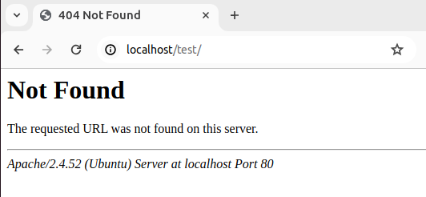
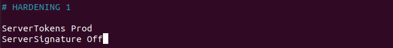
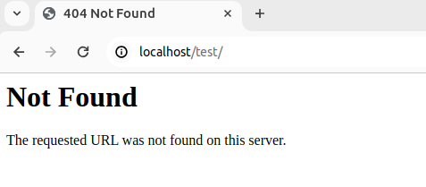
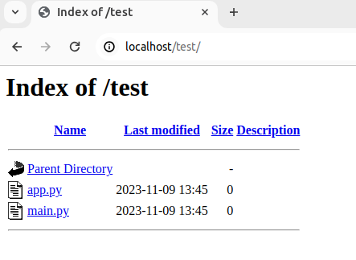
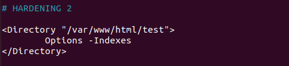
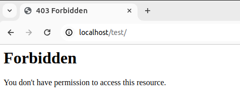

# ENDURECIMIENTO DE APACHE

## Hardening 1 - Esconder versión de Apache y la información del sistema operativo.

Punto de partida:


Vamos al /etc/httpd/conf/httpd.conf y añadios al final:


```bash
$systemctl restart apache2
```

Quedaría:


## Hardening 2 - Desactivar listado de directorios de Apache.

```bash
# Para probarlo necesitamos crear:
$ mkdir -p /var/www/html/test
$ cd /var/www/html/test
$ sudo touch app.py main.py
```

Vemos lo siguiente en el navegador:


Ahora accedemos al archivo: /etc/apache2/apache2.conf y añadimos esto al final del archivo:



Y nos dará este resultado:



## Hardening 4 - Usar HTTPS.

lucia@lucia-VirtualBox:~/practice-csr$ sudo cp carlu-server.key /etc/ssl/private/

Por último en el ficjero /etc/apache2/sites-available/default-ssl.conf editamos estas dos líneas:

- SSLCertificateFile      /etc/ssl/certs/carlu-server.crt

- SSLCertificateKeyFile /etc/ssl/private/carlu-server.key

Ahora tenemos que activar eñ sitio apache con el comando:

```bash
sudo a2ensite default-ssl
systemctl reload apache2
```
```bash 
sudo a2enmod ssl
systemctl restart apache2
```

## Hardening 