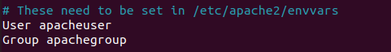

# ENDURECIMIENTO DE APACHE

## Hardening 1 - Esconder versión de Apache y la información del sistema operativo.

Punto de partida:


Vamos al /etc/httpd/conf/httpd.conf y añadios al final:


```bash
$systemctl restart apache2
```

Quedaría:


## Hardening 2 - Desactivar listado de directorios de Apache.

```bash
# Para probarlo necesitamos crear:
$ mkdir -p /var/www/html/test
$ cd /var/www/html/test
$ sudo touch app.py main.py
```

Vemos lo siguiente en el navegador:


Ahora accedemos al archivo: /etc/apache2/apache2.conf y añadimos esto al final del archivo:


Y nos dará este resultado:


## Hardening 4 - Usar HTTPS.

lucia@lucia-VirtualBox:~/practice-csr$ sudo cp carlu-server.key /etc/ssl/private/

Por último en el ficjero /etc/apache2/sites-available/default-ssl.conf editamos estas dos líneas:

- SSLCertificateFile      /etc/ssl/certs/carlu-server.crt

- SSLCertificateKeyFile /etc/ssl/private/carlu-server.key

Ahora tenemos que activar eñ sitio apache con el comando:

```bash
sudo a2ensite default-ssl
systemctl reload apache2
```
```bash 
sudo a2enmod ssl
systemctl restart apache2
```

## Hardening 5 - Enable HTTP Strict Transport Security (HSTS) for Apache


## Hardening 6 - Enable HTTP/2 on Apache

```bash
$ apache2 -v
$ sudo a2enmod http2
```

Añadir línea Protocols:


```bash
 $ sudo systemctl restart apache2
```

Comprobar:

```bash
$ curl -I --http2 -s https://domain.com/ | grep HTTP
```

## Hardening 8 - Disable the ServerSignature Directive in Apache

Comentar:


```bash
$ sudo systemctl restart apache2
```

## Hardening 9 - Set the ‘ServerTokens’ Directive to ‘Prod’

En apache2.conf


## Hardening 11 - Disable Unnecessary Modules

Ver:

```bash
$ apache2ctl -M
```

## Hardening 14 - Limit File Upload Size in Apache.

Para limitar añadimos la línea en el archivo de configuración de Apache:


## Hardening 16 - Run Apache as a Separate User and Group.

```bash
$ sudo groupadd apachegroup
$ sudo useradd -g apachegroup apacheuser
```

Ponemos los usuarios en el archivo de configuración de apache:



```bash
$ sudo chown -R apacheuser:apachegroup /var/www/html
```

Restart Apache.

## Hardening 17 - Protect DDOS Attacks and Hardening


