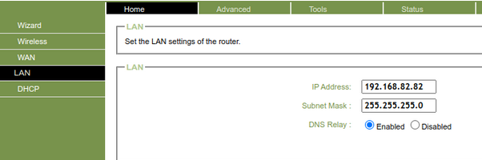
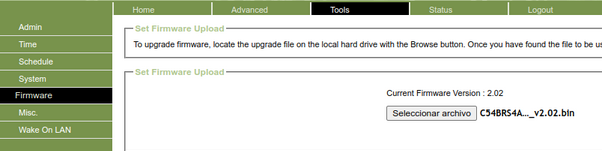
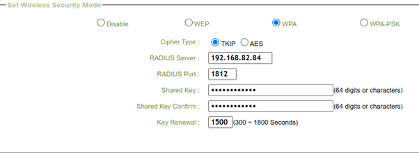
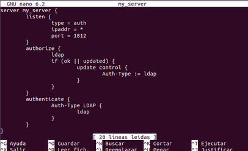
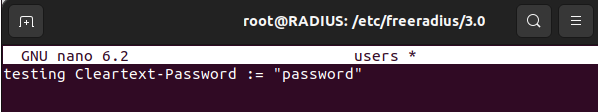
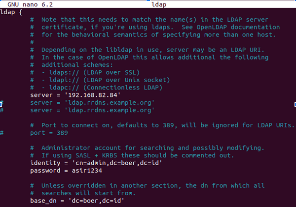
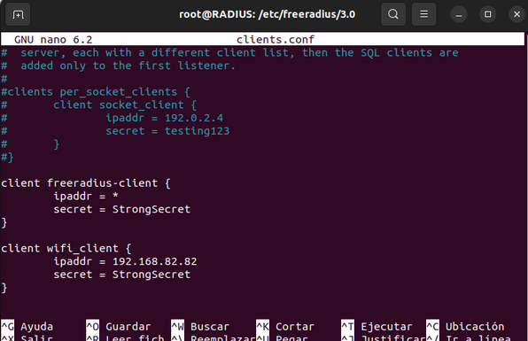
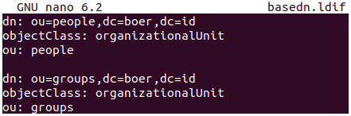
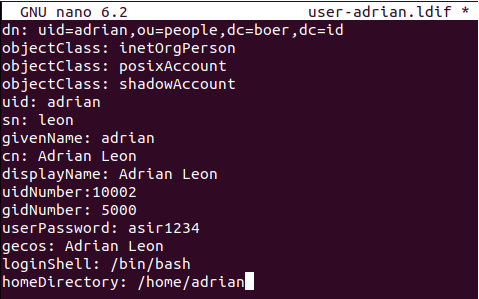
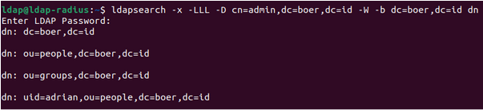

# RADIUS

En esta páctica configuraremos un router para que su acceso sea medido mediante ldap.

## PASO 1

Acceder al router Conceptronic - C54BRSA 2.0 y le ponemos una IP diferente:192.168.82.82/24.



Después de eso actualizaremos el firmware, apartado tools firmware. Seleccionamos el archivo previamente instalado.



## PASO 2

Para configurar RADIUS en el router, accedemos al apartado home wireless. Indicaremos modo WPA.



## PASO 3

En otra maquina virtual en la misma red del router instalaremos RADIUS.

```bash
sudo apt install freeradius-ldap
```

Una vez instalado nos situamos en /etc/freeradius/3.0/sites-enabled y creamos y editamos el fichero my_server con el siguiente contenido:



Hacemos:  
```bash
cp /etc/freeradius/3.0/mods-available/ldap /etc/freeradius/3.0/mods-enabled/
```
Y editamos el fichero anterior:



Y el ldap de esta manera:



Por último añadimos al cliente al fichero /etc/freeradius/3.0/clients.conf:



Reiniciar el servicio.

## PASO 3

Configuración de LDAP. Instalación:

```bash
$sudo apt -y install slapd ldap-utils

$dpkg-reconfigure slapd

$sudo slapcat
```

Creamos el archivo basedn.ldif:



Creamos el archivo user-adrian.ldif para añadir un usuario:



Los ejecutamos y coprobamos que todo se haya creado correctamente:



## COMPROBACIÓN

El último paso para poder comprobar que lo que hemos realizado ha funcionado es acceder al access point mediante el usuario Adrián que se ha regustrado en LDAP. 

En nuestro caso funcionó y también creamos otro usuario Lucia para hacer otra comprobación y funcionó.